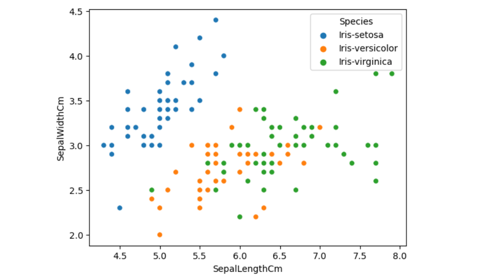
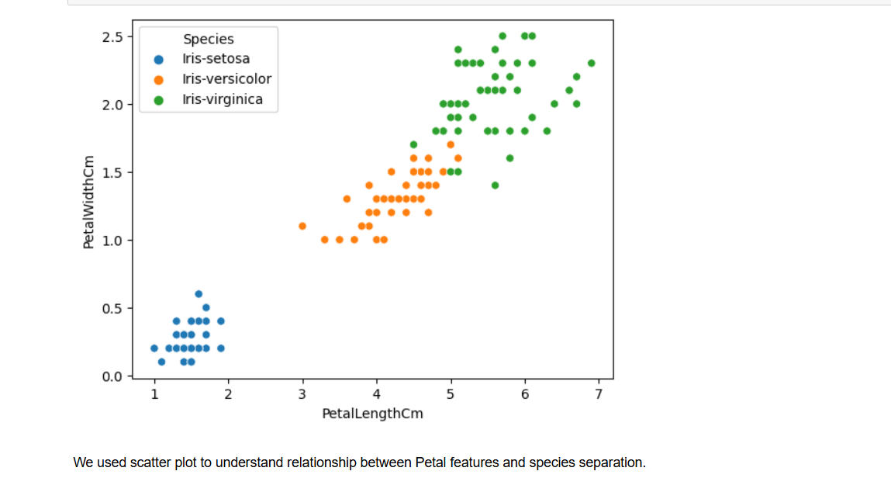
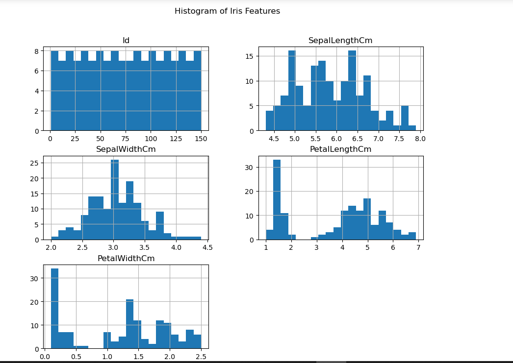
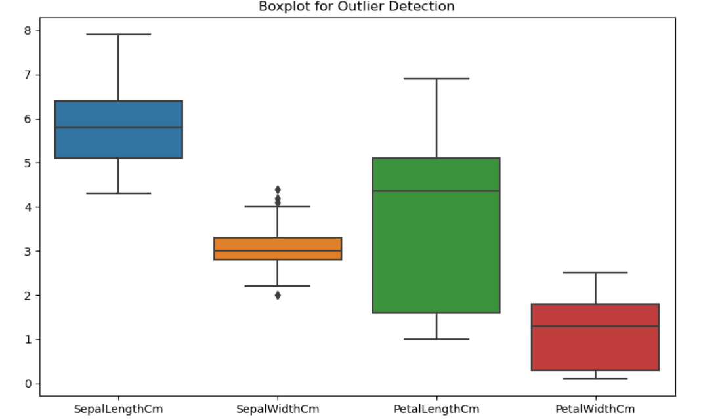
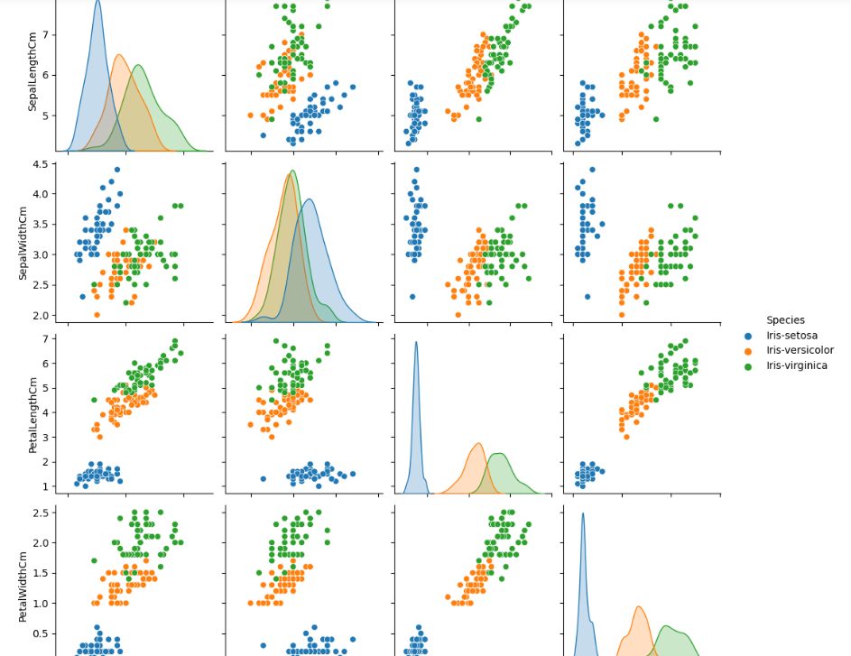

#  Task 1: Iris Dataset Exploratory Data Analysis (EDA)

## 📌 Objective
The objective of this task is to explore and understand the Iris dataset using basic data analysis and visualization techniques before applying machine learning models.

---

## 📂 Dataset Description
The Iris dataset contains 3 flower species:
- Setosa  
- Versicolor  
- Virginica  

It includes the following features:
- Sepal Length  
- Sepal Width  
- Petal Length  
- Petal Width  
- Species (Target variable)

---

## 🧠 Steps Performed

In this task, the following steps were performed:

- Imported required libraries (Pandas, Matplotlib, Seaborn)
- Loaded the dataset using Pandas
- Checked dataset shape to understand rows and columns
- Displayed column names
- Viewed first 5 rows using `head()`
- Checked dataset information using `info()`
- Generated statistical summary using `describe()`

---

## 📊 Data Visualization

The following visualizations were created:

- **Scatter Plot:** To understand relationship between features and class separation
- 
-  
- **Histogram:** To analyze distribution of each feature
- 
- **Boxplot:** To detect outliers and understand data spread
- 
- **Pairplot:** To visualize relationships between all features together
- 

---

## 🛠 Tools Used
- Python 🐍  
- Pandas  
- Matplotlib  
- Seaborn  
- Jupyter Notebook  

---

## 🎯 Conclusion
This exploratory data analysis helped in understanding the structure, distribution, and relationships within the Iris dataset. It also provided insights into class separation, making it suitable for classification problems in machine learning.

---

## 🚀 Author
Laksh Kumar
Machine Learning Internship Task Submission
