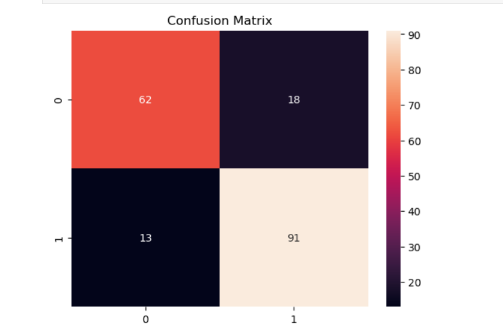
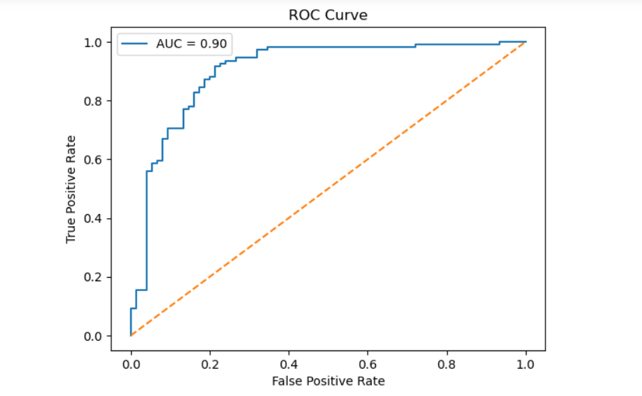
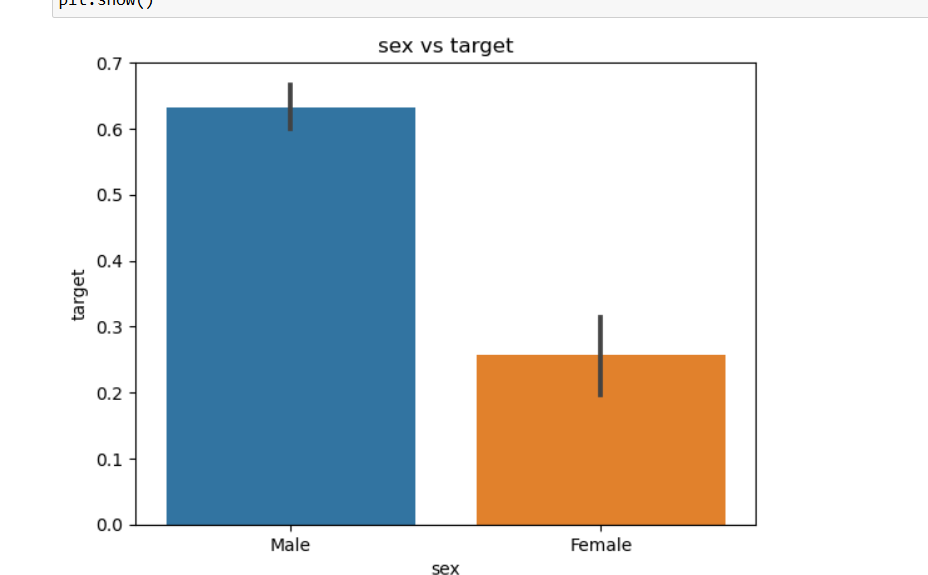

# ❤️ Heart Disease Prediction using Machine Learning

## 📌 Project Overview
This project aims to predict the presence of heart disease using patient medical data. A machine learning model is built to classify whether a person has heart disease or not based on various health indicators.

---

## 📊 Dataset
- Dataset: UCI Heart Disease Dataset
- Contains medical attributes such as:
  - Age
  - Sex
  - Chest pain type (cp)
  - Blood pressure (trestbps)
  - Cholesterol (chol)
  - Maximum heart rate (thalch)
  - ECG results (restecg)
  - And other clinical features

---

## 🧹 Data Preprocessing
- Handled missing values:
  - Numerical columns → filled using median
  - Categorical columns → filled using mode
- Removed irrelevant features:
  - `id` (identifier, not useful for prediction)
  - `dataset` (not a medical feature)
- Converted target variable:
  - Original `num` column (0–4) → binary classification
    - 0 → No heart disease
    - 1 → Heart disease present
- Encoded categorical features into numeric form

---

## 📊 Exploratory Data Analysis (EDA)
We performed data visualization to understand patterns:
- Age distribution (Histogram)
- Target class distribution (Countplot)
- Gender vs heart disease (Barplot)

---

## ⚙️ Feature Selection
- Defined:
  - `X` → All input features (excluding `num` and `target`)
  - `y` → Target variable
- Removed unnecessary columns to improve model performance

---

## 🤖 Model Training
- Model Used: Random Forest Classifier
- Reason:
  - Handles tabular data well
  - Reduces overfitting
  - Provides feature importance

- Train-Test Split:
  - 80% training data
  - 20% testing data

---

## 📈 Model Evaluation

### ✅ Accuracy
- Accuracy: ~82%

### 📊 Confusion Matrix
- Shows correct and incorrect predictions:
  - True Positive
  - True Negative
  - False Positive
  - False Negative

### 📉 ROC Curve & AUC
- ROC-AUC Score: ~0.90
- Indicates excellent ability to distinguish between classes

---

## 🖼 Visualizations

### Confusion Matrix

### ROC Curve

### Feature Importance

---

## 📊 Feature Importance
Top features contributing to prediction:
- Chest pain type (cp)
- Exercise-induced angina (exang)
- ST depression (oldpeak)
- Maximum heart rate achieved (thalch)

These features play a major role in identifying heart disease.

---

## 📌 Conclusion
A machine learning model was successfully built to predict heart disease.

- Accuracy: ~82%
- ROC-AUC: ~0.90

The model performs well and identifies key medical features responsible for heart disease prediction. It can be useful for early detection and healthcare analysis.

---

## 🚀 Technologies Used
- Python
- Pandas
- NumPy
- Matplotlib
- Seaborn
- Scikit-learn

---

## 👨‍💻 Author
Laksh Kumar  
Machine Learning Internship Project
