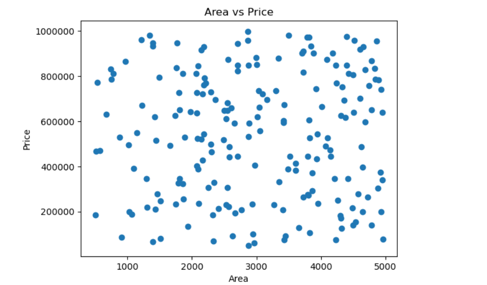
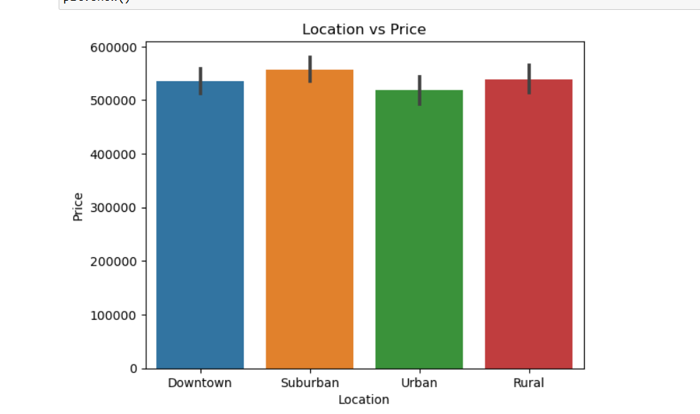
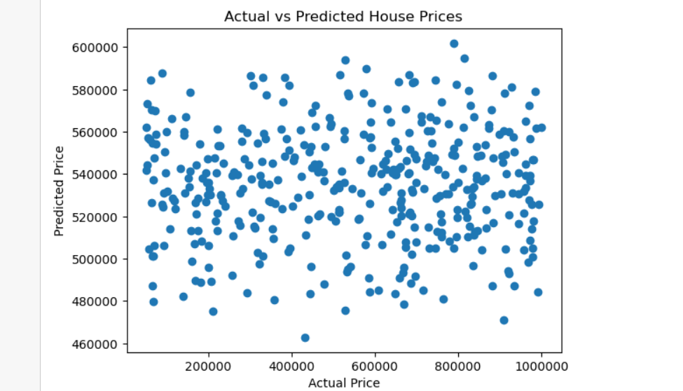
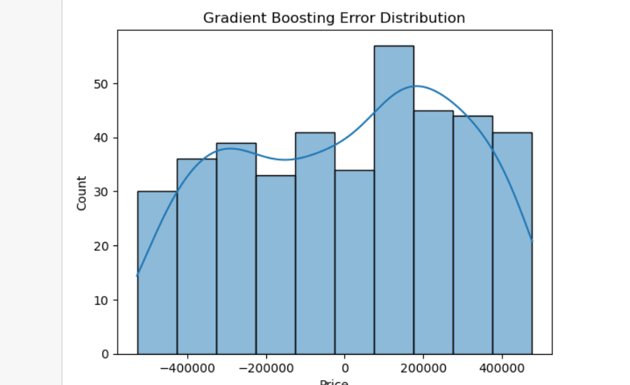

# 🏠 House Price Prediction

## 📌 Overview

This project focuses on predicting house prices using machine learning techniques.
We analyze various property features such as area, bedrooms, bathrooms, location, and condition to build predictive models.

---

## 📊 Dataset

The dataset contains the following features:

* Area
* Bedrooms
* Bathrooms
* Floors
* YearBuilt
* Location
* Condition
* Garage
* Price (Target Variable)

---

## 🔍 Exploratory Data Analysis (EDA)

We performed data visualization to understand relationships between features and house prices.

### 📈 Area vs Price

* Larger houses tend to have higher prices
* Some variation exists due to other factors

### 📍 Location vs Price

* Price varies significantly across different locations
* Location is an important factor affecting house prices

### 🎨 Multi-variable Visualization

* Combined visualization shows how Area and Location together affect price

---

## 📊 Visualizations

### 📈 Area vs Price

👉 Larger houses generally have higher prices.

---

### 📍 Location vs Price

👉 Prices vary across locations.

---

## 🧹 Data Preprocessing

* Removed unnecessary column (`Id`)
* Converted categorical variables using one-hot encoding
* Selected features and target variable

---

## 🎯 Feature Selection

* **X (Features):** All columns except Price
* **y (Target):** Price

---

## 🔀 Train-Test Split

* 80% training data
* 20% testing data

---

## 🤖 Models Used

### 1️⃣ Linear Regression

* Simple and interpretable model
* Captures linear relationships in data

#### 📊 Evaluation

* MAE (Mean Absolute Error)
* RMSE (Root Mean Squared Error)

#### 📈 Result

* Model performed well on predicting general price trends

---

### 2️⃣ Gradient Boosting Regressor

* Ensemble model for improved performance
* Captures complex patterns

#### 📊 Evaluation

* MAE
* RMSE

#### 📉 Observation

* Performance was similar to Linear Regression
* No significant improvement observed

---

## 📊 Model Evaluation

### 📉 Actual vs Predicted Prices

👉 Shows how close predictions are to real values.

---

* Most predictions are close to actual values
* Some deviations exist due to data variability

### 📊 Error Distribution  

👉 Most errors are close to zero, indicating good model performance.
---

## 📌 Feature Importance

* Area is the most influential feature
* Location impact is distributed across multiple encoded columns
* Other features contribute moderately

---

## 🔄 Model Comparison

| Model             | Performance |
| ----------------- | ----------- |
| Linear Regression | Good        |
| Gradient Boosting | Similar     |

👉 Both models achieved almost the same results

---

## 🧠 Key Insights

* Area strongly influences house prices
* Location is important but split across encoded features
* Most relationships in the dataset are linear

---

## 🏁 Conclusion

* Both Linear Regression and Gradient Boosting models were applied
* No significant improvement was observed using a complex model
* This indicates that the dataset has mostly linear relationships

### 🚀 Final Insight

A simple Linear Regression model is sufficient for predicting house prices in this dataset.

---

---

## 💡 Future Improvements

* Apply advanced feature engineering
* Use hyperparameter tuning
* Handle outliers more effectively
* Try advanced models like XGBoost

---

## 👤 Author

**Laksh Kumar**
Machine Learning Internship

---
